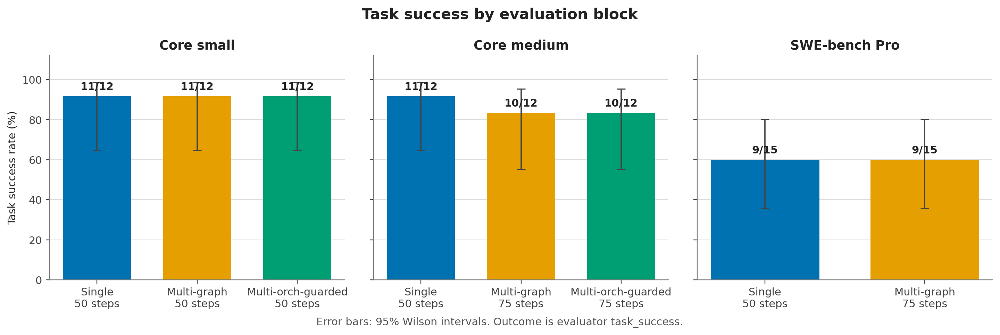
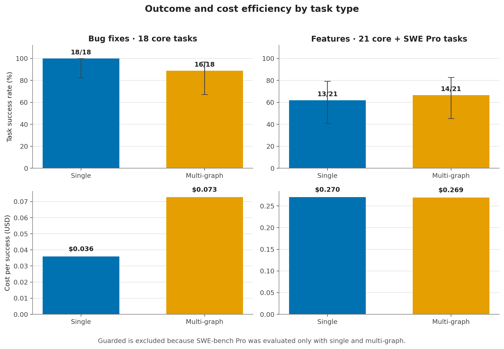
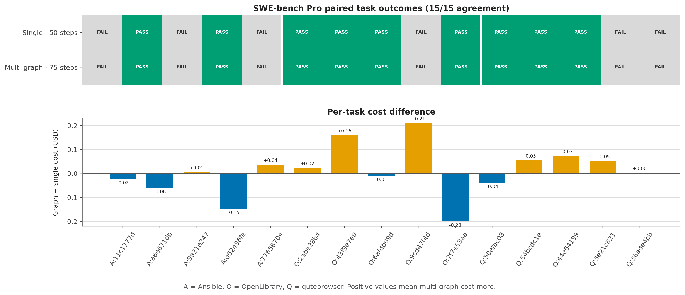

# Final Benchmark Results

Status: final primary comparison completed; local large-repository extension
incomplete because of an infrastructure setup failure.

Date: 2026-07-16

## Executive Summary

This project tested whether agent architecture can make repository-level
software engineering tasks both **better and cheaper** than a strengthened
single-agent loop.

The primary comparison contains 102 scored runs over 39 unique tasks:

- 24 local core tasks from small and medium Python repositories;
- 15 selected SWE-bench Pro tasks;
- `single`, `multi-graph`, and `multi-orch-guarded` on the core tasks;
- `single` and `multi-graph` on SWE-bench Pro.

The evaluated multi-agent systems did not outperform the strengthened
single-agent baseline on the main objective:

- across the 39 tasks shared by `single` and `multi-graph`, single resolved
  **31/39** and graph resolved **30/39**;
- graph spent **$4.9328**, compared with **$4.1605** for single;
- graph therefore cost 18.6% more while resolving one fewer task;
- on the 15 SWE-bench Pro tasks, the two systems produced identical success and
  failure outcomes: **9/15** for both;
- `multi-orch-guarded` matched graph's core resolve count but cost more.

The strongest conclusion is that the strengthened single loop is the best
default architecture in the evaluated setting. Multi-agent decomposition added
steps, coordination, and cost without producing a consistent increase in task
success.

There is a weak signal that deterministic role decomposition may help some
feature or held-out tasks. It is driven by one task and is not statistically
strong enough to establish an advantage.

## Research Question

The central hypothesis was:

> A strong single-agent loop should be more cost-effective on simple localized
> tasks, while a multi-agent workflow should become more useful as task and
> repository complexity increase.

The experiment tested two practical questions:

1. Does a multi-agent architecture resolve more repository-level tasks?
2. Is any improvement large enough to justify additional model calls, tokens,
   execution steps, wall-clock time, and system complexity?

For the tested model, tasks, and implementations, the answer to both questions
is **no**.

## What the Project Implemented

The repository contains a reproducible evaluation system rather than only a
collection of prompts:

- an immutable agent state and explicit action protocol;
- a strengthened single-agent development loop;
- deterministic `multi-graph` role routing;
- supervised and phase-guarded multi-agent orchestration;
- optional task decomposition and role-specific model routing;
- Docker-isolated repository workspaces;
- visible, hidden semantic, hidden compatibility, and regression evaluation;
- test-oracle protection and role-specific file-edit policies;
- context compaction with deterministic preservation of inspected facts;
- token, cost, action, role, and execution tracing;
- resumable benchmark sessions with frozen task manifests and fingerprints;
- a web console for inspecting sessions, runs, metrics, costs, and logs;
- reproducible CSV, PNG, and SVG result generation.

The final comparison used `z-ai/glm-5.2` through OpenRouter with the
`text_json` action transport.

## Compared Architectures

### Strengthened single

One model performs research, planning, implementation, testing, and repair in
one loop. The final baseline includes:

- pre-plan and post-plan no-progress guards;
- durable search reuse across context compaction;
- deterministic preservation of recent inspections and searches;
- a compatibility verification gate after the latest edit.

### Multi-graph

A deterministic role workflow separates planning, development, testing, and
review. Routing is controlled by the graph rather than by an unconstrained
supervisor decision.

### Multi-orch-guarded

A supervisor delegates work to specialized roles while enforced phase gates
and quotas prevent invalid transitions and phase starvation.

## Benchmark Design

The primary metric is evaluator `task_success`, not the agent's internal
`status`. A task is successful only when the final workspace passes the visible
tests and every required hidden semantic or compatibility suite.

| Block | Tasks | Architectures | Step policy |
| --- | ---: | --- | --- |
| Core small | 12 | single, graph, guarded | 50 for all |
| Core medium | 12 | single, graph, guarded | single 50; multi 75 |
| SWE-bench Pro | 15 | single, graph | single 50; graph 75 |

The core-small block is the strict equal-step pilot. The larger blocks allow
multi-agent systems 75 steps because role handoffs consume additional workflow
steps. Results are therefore reported by block. Pooled values are secondary
summaries rather than equal-budget estimates.

Cost uses complete provider-reported billing when every model call reported a
cost; otherwise it uses the repository's token-based estimate.

## Primary Results

| Block | Architecture | Resolved | Rate | Total cost | Cost/success | Mean steps | Mean duration |
| --- | --- | ---: | ---: | ---: | ---: | ---: | ---: |
| Core small | Single | 11/12 | 91.7% | $0.3765 | $0.0342 | 21.4 | 169 s |
| Core small | Multi-graph | 11/12 | 91.7% | $0.7642 | $0.0695 | 34.3 | 236 s |
| Core small | Multi-orch-guarded | 11/12 | 91.7% | $0.9707 | $0.0882 | 37.7 | 249 s |
| Core medium | Single | 11/12 | 91.7% | $0.4764 | $0.0433 | 19.7 | 171 s |
| Core medium | Multi-graph | 10/12 | 83.3% | $0.7274 | $0.0727 | 40.8 | 291 s |
| Core medium | Multi-orch-guarded | 10/12 | 83.3% | $0.9331 | $0.0933 | 41.8 | 378 s |
| SWE-bench Pro | Single | 9/15 | 60.0% | $3.3077 | $0.3675 | 28.5 | 489 s |
| SWE-bench Pro | Multi-graph | 9/15 | 60.0% | $3.4412 | $0.3824 | 49.5 | 485 s |

### Core aggregate

The 24-task core aggregate mixes the equal-step small block with the
architecture-sensitive medium step policy, so it is secondary.

| Architecture | Resolved | Total cost | Cost/success | Total steps | Total tokens |
| --- | ---: | ---: | ---: | ---: | ---: |
| Single | **22/24** | **$0.8529** | **$0.0388** | **493** | **3.12M** |
| Multi-graph | 21/24 | $1.4916 | $0.0710 | 902 | 3.62M |
| Multi-orch-guarded | 21/24 | $1.9038 | $0.0907 | 953 | 4.05M |

Compared with single on core:

- graph used 83% more steps and cost 75% more;
- guarded used 93% more steps and cost 123% more;
- both resolved one fewer task.

### Matched single versus graph aggregate

Across all 39 tasks evaluated by both architectures:

| Architecture | Resolved | Rate | Total cost | Cost/success |
| --- | ---: | ---: | ---: | ---: |
| Single | **31/39** | **79.5%** | **$4.1605** | **$0.1342** |
| Multi-graph | 30/39 | 76.9% | $4.9328 | $0.1644 |

Paired outcomes:

- 36 tasks had the same outcome;
- single uniquely resolved 2 tasks;
- graph uniquely resolved 1 task.

The three disagreements were:

- `markdown_pr_1546`: single only;
- `sqlparse_pr_746`: single and guarded, but not graph;
- `sqlparse_pr_749`: graph only.

## Results by Task Type

All SWE-bench Pro tasks in this selected subset are feature tasks. The bug-fix
comparison therefore comes from core, while the feature comparison combines
core and SWE-bench Pro.

| Task type | Architecture | Resolved | Rate | Total cost | Cost/success |
| --- | --- | ---: | ---: | ---: | ---: |
| Bug fix, 18 tasks | Single | **18/18** | **100.0%** | **$0.6476** | **$0.0360** |
| Bug fix, 18 tasks | Multi-graph | 16/18 | 88.9% | $1.1634 | $0.0727 |
| Feature, 21 tasks | Single | 13/21 | 61.9% | $3.5129 | $0.2702 |
| Feature, 21 tasks | Multi-graph | **14/21** | **66.7%** | $3.7694 | **$0.2692** |

The feature result is the only slice that favors graph on task success. Its
cost per success is effectively equal to single. However:

- the difference is only one task;
- the 95% Wilson confidence intervals overlap substantially;
- the graph-only win occurred in core on `sqlparse_pr_749`;
- SWE-bench Pro outcomes were identical for every paired task.

This is a useful direction for future work, but not evidence that multi-agent
execution is generally better for feature development.

## Held-Out Versus Previously Exercised Tasks

The frozen manifest marks tasks that had exploratory runs before the final
architecture comparison. The completed paired dataset contains 20 previously
exercised tasks and 19 held-out tasks.

| Exposure | Single | Multi-graph |
| --- | ---: | ---: |
| Previously exercised, 20 tasks | **19/20 (95.0%)** | 17/20 (85.0%) |
| Held-out, 19 tasks | 12/19 (63.2%) | **13/19 (68.4%)** |

The held-out slice again gives graph a one-task advantage, but it is the same
`sqlparse_pr_749` disagreement. Fourteen of the 19 held-out tasks are SWE-bench
Pro tasks where the architectures had identical outcomes.

## SWE-bench Pro Result

The SWE-bench Pro block provides the clearest paired comparison on larger and
more expensive tasks:

- both architectures resolved 9/15 tasks;
- all 15 paired outcomes were identical;
- graph cost 4.0% more;
- graph used 73% more workflow steps;
- graph used 3.5% fewer recorded tokens;
- wall-clock duration was effectively equal.

This block provides no evidence that role decomposition improved correctness.
It shows that additional graph steps do not necessarily translate into higher
token usage or longer wall-clock time, but they also did not improve the final
patches.

## Cost Summary

- Primary scored comparison, 102 runs: **$10.9971**.
- Incomplete local-large attempt: **$0.1099**.
- Complete recorded `final_v1_main` campaign: **$11.1070**.
- All 291 exploratory and final runs currently recorded in `runs.jsonl`:
  **$20.9396**.

The complete experiment history remained below the project's $50 experimental
budget. The all-run value includes development probes and ablations and must
not be treated as the cost of the final benchmark alone.

## Local Large-Repository Extension

The frozen task set also selected two local SQLGlot tasks. This block did not
produce a valid paired comparison:

- `sqlglot_pr_7660486c` failed setup twice before any model call because
  editable installation could not derive a version without Git metadata;
- `sqlglot_pr_45931d44` completed one single-agent attempt, which failed
  evaluation after 27 steps and cost $0.1099;
- the queued graph session did not start after the preceding sweep returned a
  non-zero exit status.

The single unpaired result is excluded from every primary table and figure.
Consequently, this project cannot make a final claim about whether architecture
effects change again in repositories above the large-repository threshold.

## Additional Behavioral Observations

- Every primary run produced a patch, giving a 100% recorded patch-production
  rate.
- No primary architecture ended in an explicit human handoff.
- Recorded regression rates were zero in every block except core-medium graph,
  where one run recorded a regression.
- Visible tests were often insufficient to predict success. In SWE-bench Pro,
  visible tests passed in every run, while required hidden evaluation passed in
  only 60%.
- Tool-use validity stayed around 94-97% across blocks. Coordination did not
  remove malformed or invalid actions.
- Agent `status` sometimes disagreed with evaluation, confirming that
  `task_success` must remain the outcome metric.

## Threats to Validity

1. **Sample size.** There is one final attempt per task and architecture.
   Confidence intervals are wide, especially after splitting by task type.
2. **Single model family.** The primary benchmark uses GLM 5.2. The conclusion
   may not transfer unchanged to stronger or role-specialized models.
3. **Different step policies.** Multi-agent systems received more steps on
   core-medium and SWE-bench Pro. This reflects workflow requirements but is
   not an equal-step comparison.
4. **Task exposure.** Twenty paired tasks had exploratory exposure. Held-out
   results are reported separately, but the held-out sample remains small.
5. **Feature composition.** Fifteen of 21 feature tasks come from SWE-bench Pro,
   while all bug-fix tasks come from core.
6. **Architecture coverage.** Guarded orchestration was not run on SWE-bench
   Pro because it cost more without improving core resolve rate.
7. **Large repositories.** The local-large extension was not completed.
8. **Quality rubric.** Final patches were evaluated functionally, but the final
   campaign did not receive a new blinded maintainability and robustness review.
9. **Cost source.** Cost uses provider billing when complete and local pricing
   estimates otherwise.
10. **Public data.** Public repositories and merged pull requests may have
    appeared in model training data.

## Final Verdict

The project does not confirm the hypothesis that multi-agent architecture
becomes better and economically preferable on more complex repository-level
tasks.

For the evaluated system:

- the strengthened single loop is the most reliable and cost-effective default;
- deterministic graph decomposition is a plausible targeted variant for some
  feature tasks, but it is not a generally superior replacement;
- guarded orchestration adds the most coordination overhead and did not improve
  resolve rate;
- role separation alone is insufficient to create better solutions when all
  roles use the same underlying model and evidence;
- future gains are more likely to come from selective routing, stronger models
  for difficult implementation stages, improved context allocation, or task
  classifiers that invoke multi-agent workflows only when their expected value
  is positive.

The practical answer to the project's original question is:

> In this benchmark, architecture alone did not make repository-level
> development both cheaper and better than a strong single-agent loop.

## Reproducibility and Evidence

- Frozen task set:
  [`eval/task_sets/final_v1.json`](../eval/task_sets/final_v1.json)
- Benchmark design:
  [`docs/final_benchmark_task_set.md`](final_benchmark_task_set.md)
- Raw run records:
  [`experiments/results/runs.jsonl`](../experiments/results/runs.jsonl)
- Exact block aggregates:
  [`experiments/results/final_report/summary.csv`](../experiments/results/final_report/summary.csv)
- Task-type aggregates:
  [`experiments/results/final_report/task_type_summary.csv`](../experiments/results/final_report/task_type_summary.csv)
- Reproducible figure generator:
  [`experiments/results/final_report/generate_figures.py`](../experiments/results/final_report/generate_figures.py)
- Generated figures:
  [`experiments/results/final_report/figures`](../experiments/results/final_report/figures)
