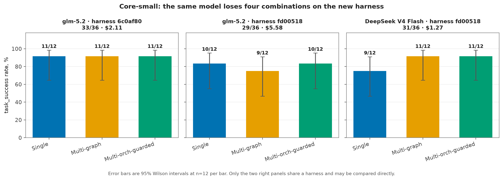
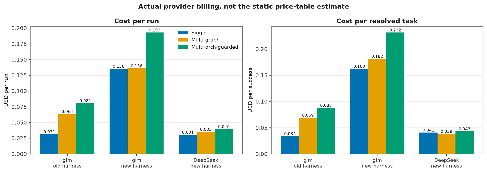
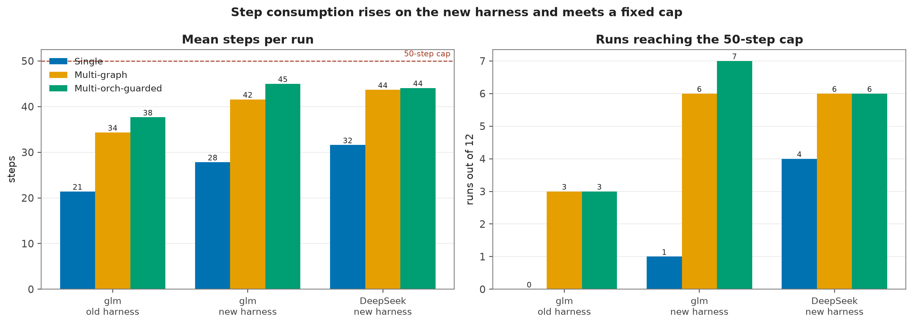
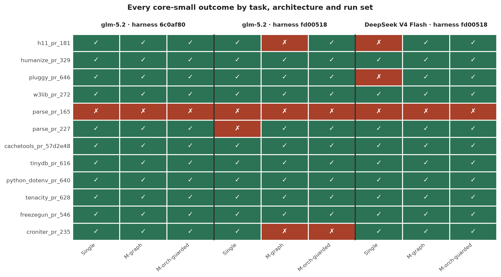
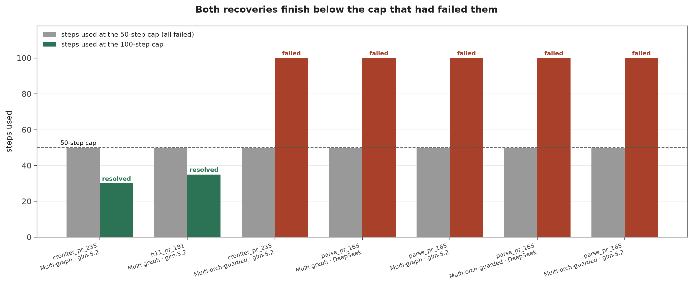

# Kernel v2 Core-Small Re-measurement

Generated by `generate_figures.py`. Costs are actual provider billing.

## Run sets

| Run set | Model | Harness | Resolved | Cost | Tokens | Mean steps | At 50-step cap |
| --- | --- | --- | ---: | ---: | ---: | ---: | ---: |
| glm-5.2 · harness 6c0af80 | `z-ai/glm-5.2` | `6c0af80` | **33/36** | $2.1113 | 5,309,440 | 31.1 | 6/36 |
| glm-5.2 · harness fd00518 | `z-ai/glm-5.2` | `fd00518` | **29/36** | $5.5807 | 7,900,067 | 38.1 | 14/36 |
| DeepSeek V4 Flash · harness fd00518 | `deepseek/deepseek-v4-flash-0731:nitro` | `fd00518` | **31/36** | $1.2687 | 7,412,402 | 39.8 | 16/36 |

## By architecture

| Run set | Architecture | Resolved | 95% Wilson | Cost | Cost per success |
| --- | --- | ---: | ---: | ---: | ---: |
| glm-5.2 · harness 6c0af80 | Single | 11/12 | 65–99% | $0.3765 | $0.0342 |
| glm-5.2 · harness 6c0af80 | Multi-graph | 11/12 | 65–99% | $0.7642 | $0.0695 |
| glm-5.2 · harness 6c0af80 | Multi-orch-guarded | 11/12 | 65–99% | $0.9707 | $0.0882 |
| glm-5.2 · harness fd00518 | Single | 10/12 | 55–95% | $1.6271 | $0.1627 |
| glm-5.2 · harness fd00518 | Multi-graph | 9/12 | 47–91% | $1.6354 | $0.1817 |
| glm-5.2 · harness fd00518 | Multi-orch-guarded | 10/12 | 55–95% | $2.3182 | $0.2318 |
| DeepSeek V4 Flash · harness fd00518 | Single | 9/12 | 47–91% | $0.3685 | $0.0409 |
| DeepSeek V4 Flash · harness fd00518 | Multi-graph | 11/12 | 65–99% | $0.4242 | $0.0386 |
| DeepSeek V4 Flash · harness fd00518 | Multi-orch-guarded | 11/12 | 65–99% | $0.4760 | $0.0433 |

## Task matrix

| Task | glm old harness · Sin | glm old harness · Mul | glm old harness · Mul | glm new harness · Sin | glm new harness · Mul | glm new harness · Mul | DeepSeek new harness · Sin | DeepSeek new harness · Mul | DeepSeek new harness · Mul |
| --- | :---: | :---: | :---: | :---: | :---: | :---: | :---: | :---: | :---: |
| `h11_pr_181` | ✅ | ✅ | ✅ | ✅ | ❌ | ✅ | ❌ | ✅ | ✅ |
| `humanize_pr_329` | ✅ | ✅ | ✅ | ✅ | ✅ | ✅ | ✅ | ✅ | ✅ |
| `pluggy_pr_646` | ✅ | ✅ | ✅ | ✅ | ✅ | ✅ | ❌ | ✅ | ✅ |
| `w3lib_pr_272` | ✅ | ✅ | ✅ | ✅ | ✅ | ✅ | ✅ | ✅ | ✅ |
| `parse_pr_165` | ❌ | ❌ | ❌ | ❌ | ❌ | ❌ | ❌ | ❌ | ❌ |
| `parse_pr_227` | ✅ | ✅ | ✅ | ❌ | ✅ | ✅ | ✅ | ✅ | ✅ |
| `cachetools_pr_57d2e48` | ✅ | ✅ | ✅ | ✅ | ✅ | ✅ | ✅ | ✅ | ✅ |
| `tinydb_pr_616` | ✅ | ✅ | ✅ | ✅ | ✅ | ✅ | ✅ | ✅ | ✅ |
| `python_dotenv_pr_640` | ✅ | ✅ | ✅ | ✅ | ✅ | ✅ | ✅ | ✅ | ✅ |
| `tenacity_pr_628` | ✅ | ✅ | ✅ | ✅ | ✅ | ✅ | ✅ | ✅ | ✅ |
| `freezegun_pr_546` | ✅ | ✅ | ✅ | ✅ | ✅ | ✅ | ✅ | ✅ | ✅ |
| `croniter_pr_235` | ✅ | ✅ | ✅ | ✅ | ❌ | ❌ | ✅ | ✅ | ✅ |

## Probes outside the comparable block

| Session | Runs | Resolved | Cost | Note |
| --- | ---: | ---: | ---: | --- |
| `kernel_v2_glm_5_2_core_small_steps100` | 5 | 2/5 | $1.1989 | glm-5.2 at a 100-step cap, only the runs that exhausted 50 |
| `kernel_v2_ds_v4_flash_0731_nitro_low_parse165_steps100` | 2 | 0/2 | $0.1915 | DeepSeek at a 100-step cap, `parse_pr_165` only |
| `kernel_v2_terra_high_pilot` | 3 | 3/3 | $1.7222 | `openai/gpt-5.6-terra` at `high`, `h11_pr_181` only |
| `kernel_v2_terra_high_parse165` | 3 | 3/3 | $2.3324 | `openai/gpt-5.6-terra` at `high`, `parse_pr_165` only |

## Figures

### Success rate by architecture for the three run sets

### Cost per run and cost per resolved task

### Mean steps and runs reaching the 50-step cap

### Every outcome by task, architecture and run set

### Steps used before and after raising the cap to 100

